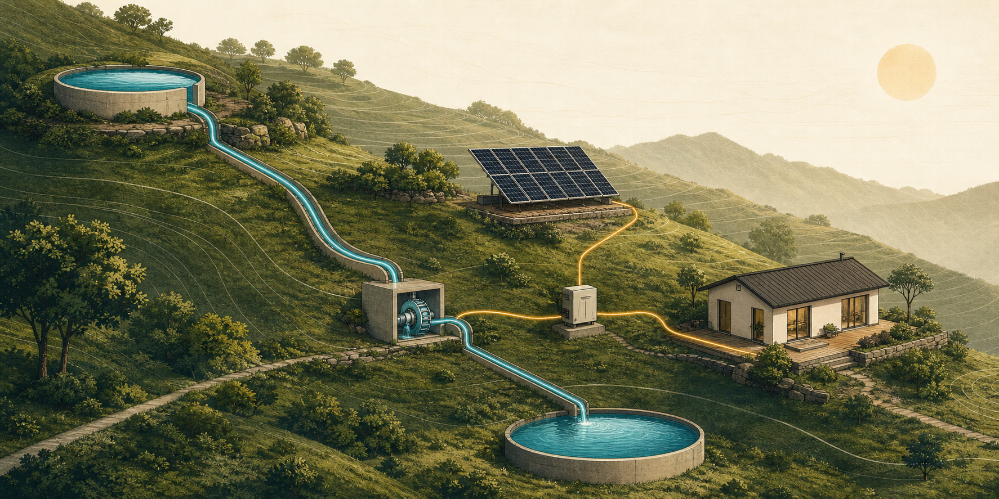

# EnergyCircle

**Property energy systems, made legible.**

EnergyCircle is an interactive planning environment for understanding how a
property-scale energy system behaves as one connected whole. Its Build Week
reference scenario models a hillside pumped-water storage system connecting
solar generation, reservoirs, a pump, hydraulic routing, a micro turbine, an
inverter, and critical household loads.

## The judging path

1. Open the **Hillside Water Storage** reference scenario.
2. Drag the upper reservoir uphill.
3. Watch geometry, pipe routing, head, hydraulic loss, stored energy, runtime,
   warnings, system verdict, and the causal explanation update together.
4. Switch between **Property**, **System**, and **Blueprint** to see the same
   project revision represented three ways.
5. Toggle **Intake obstruction** to trace a deterministic failure through the
   water path and into the energy verdict.

The initial reference scenario is intentionally **FRAGILE**: its modeled usable
storage is 6.47 kWh against a defined 7.2 kWh autonomy target. One direct
manipulation can cross that threshold, making the reason visible rather than
merely reporting a score.

## What is implemented

- Direct manipulation of every property component
- Governed preview transactions with one revision committed at interaction end
- A deterministic hydraulic and energy calculation engine
- Darcy-Weisbach pipe-loss modeling for the reference system
- Live head, loss, storage, runtime, warning, and feasibility outputs
- Property, system, and blueprint views derived from one canonical state
- Causal insights that explain consequences without making unsupported decisions
- Explicit **assumed**, **calculated**, and **unknown** truth states
- Deterministic intake-obstruction failure propagation
- Keyboard-accessible component movement and reduced-motion support
- Unit, server-render, and real-browser interaction tests

## Canonical-state rule

No representation updates independently. Every meaningful domain interaction
passes through a governed EnergyCircle state transition. Calculations, warnings,
verdicts, visualizations, and explanations are then derived from that revision.
Selection, hover, and view mode remain local view state and never become
physical project data.

The approved [Product Scope](SCOPE.md) and
[Engineering Constitution](ENGINEERING_CONSTITUTION.md) govern this milestone.

## Built with Codex and GPT-5.6

OpenAI Codex and GPT-5.6 were used as the implementation partner throughout the
Build Week development period. The collaboration included:

- translating the approved scope and constitution into verifiable source code;
- implementing the new deterministic engine and transaction model;
- connecting every renderer to canonical EnergyCircle state;
- generating and stress-testing the causal-insight interaction;
- building unit, server-render, and Microsoft Edge interaction tests;
- reviewing accessibility, responsive behavior, and Build Week submission needs;
- generating the original social-preview illustration used by this repository.

Engineering decisions remained constrained by the approved product definition.
AI-authored explanations are not allowed to create physical values, feasibility
scores, or recommendations outside the governed deterministic engine.

## Build Week provenance

This repository's EnergyCircle implementation was written as new work for
OpenAI Build Week 2026. A pre-Build Week EnergyCircle prototype archived on
July 8, 2026 was used as product-definition lineage for the nine-family energy
catalog: solar PV, solar thermal, wind, water and pressure, bioenergy, thermal
recovery, mechanical and human power, gravity storage, and coordinated hybrid
systems. Its application code, calculations, interface, and assets were not
imported into this repository.

The prior Metabolic Systems Builder project was also inspected only as reference
material for design lineage, deterministic-engineering lessons, and
architectural anti-patterns. **No source code or assets from either prior
application were reused in this Build Week implementation.**

## Run locally

Requirements: Node.js 22.13 or newer.

~~~bash
npm install
npm run dev
~~~

Open **http://localhost:5173**.

## Verify

~~~bash
npm test
npm run lint
~~~

The test command runs deterministic engine tests, a production build,
server-render checks, and a real-browser interaction test. The browser test
uses Microsoft Edge, Chrome, or Chromium when available and otherwise reports
a skip.

## Technology

- React 19
- TypeScript
- vinext / Vite
- Cloudflare Workers-compatible production output
- Node test runner
- Playwright Core for browser verification

## Model boundary

EnergyCircle is an explanatory planning model, not a construction
recommendation. Reference terrain, flow, efficiency, storage, and load values
are labeled assumptions. Geotechnical conditions, installed cost, and permit
requirements remain explicitly unknown.

## License

[MIT](LICENSE)
